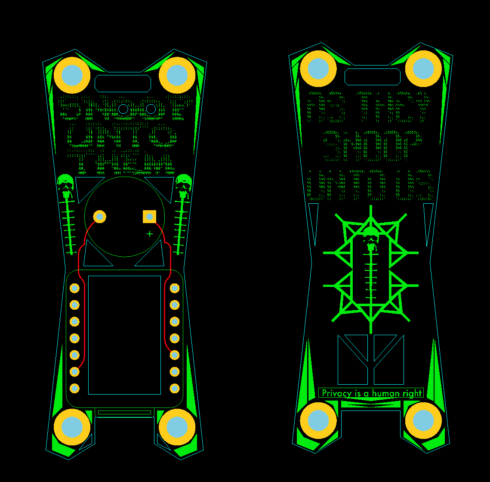

# OUI-SPY

**ESP32-S3 based multi-mode detection system with integrated buzzer and power management.**

This board has sick PCB art. Available on [Tindie](https://www.tindie.com) and [colonelpanic.tech](https://colonelpanic.tech) - Ready-to-use, no additional components required.

> **All current firmware is passive and detection-only.** Nothing transmitted, nothing exploited — just listening. This is the **Blue Edition** (defensive/recon). A **Red Edition** with offensive capabilities is in development and will be released separately. Stay tuned.

---

## Firmware Options

### [OUI-SPY Unified Blue](https://github.com/colonelpanichacks/oui-spy-unified-blue) ⭐ RECOMMENDED

**All four modes in one firmware — select from a boot menu, reboot, and go.**

One flash, four capabilities. The unified build combines Detector, Foxhunter, Flock-You, and Sky Spy into a single firmware with a WiFi-based boot selector. No reflashing needed to switch modes.

- **Boot selector** on AP `oui-spy` / `ouispy123` at `192.168.4.1`
- **Hold BOOT button** 2 seconds to return to the selector from any mode
- **MAC randomization** on every boot for privacy
- **Global buzzer toggle** from the selector menu
- **Distinct boot sounds** per mode — each plays its own retro tune so you know which firmware you're in
- **Persistent mode selection** — remembers your last choice across power cycles
- **Configurable AP** — change the selector SSID/password from the web UI

Includes all features from the standalone firmwares below, plus GPS wardriving in Flock-You mode, session persistence to flash, KML export for Google Earth, and a prior session history tab.

**Use Cases:** Everything. Flash once, switch modes on the fly.

---

### [OUI-SPY Detector](https://github.com/colonelpanichacks/ouispy-detector)

**Multi-target BLE device scanner with OUI filtering**

- Detects multiple devices simultaneously by MAC address or manufacturer OUI
- Web-based configuration portal for target management
- Smart cooldown system prevents alert spam
- Audio feedback with different beep patterns for new vs. re-detected devices
- Persistent configuration storage
- Good for general surveillance and device monitoring

**Use Cases:** Security monitoring, device inventory, general BLE scanning

---

### [OUI-SPY Foxhunter](https://github.com/colonelpanichacks/ouispy-foxhunter)

**Precision proximity tracker for radio direction finding**

- Single target MAC address tracking with real-time RSSI analysis
- Variable proximity beeping based on signal strength (closer = faster beeps)
- Optimized for directional antenna usage and triangulation
- Aggressive scanning parameters for maximum sensitivity
- Clean audio feedback system for field operations
- Good for foxhunting competitions and asset recovery

**Use Cases:** Radio direction finding, asset tracking, security device location, RF analysis

---

### [OUI-SPY UniPwn](https://github.com/colonelpanichacks/Oui-Spy-UniPwn)

**Advanced Unitree robot exploitation system with web interface**

- BLE-based command injection exploits for Unitree Go2, G1, H1, and B2 robots
- AutoPwn automation with 7-step exploitation and bulletproof error handling
- Real-time BLE scanning with signal strength indicators and target management
- Custom command injection with SSID/password injection methods
- Comprehensive web interface with operations logging and system monitoring
- AES-CFB128 encryption implementation for Unitree's crypto protocol
- Based on original research by Bin4ry and d0splash

**Use Cases:** Security research, authorized penetration testing, educational robotics security assessment

---

### [Flock-You](https://github.com/colonelpanichacks/flock-you)

**Flock Safety & Raven surveillance device detector with web dashboard and GPS wardriving**

- BLE-only detection — MAC prefix, device name, manufacturer ID (`0x09C8` XUNTONG), Raven UUID fingerprinting
- WiFi AP dashboard at `192.168.4.1` with live detection feed, pattern DB, and export tools
- GPS wardriving via phone browser Geolocation API — tags every detection with coordinates
- Session persistence to flash (SPIFFS) with prior session history tab
- Export as JSON, CSV, or KML (Google Earth) — current and prior sessions
- Flask-compatible serial JSON output for live desktop ingestion
- Crow call boot sounds, detection alerts, and heartbeat audio feedback
- 200 unique device storage with thread-safe FreeRTOS mutex
- Companion Flask desktop app in `api/` folder with JSON/CSV/KML import

**Use Cases:** Surveillance detection, privacy auditing, wardriving, security research

---

### [Sky-Spy](https://github.com/colonelpanichacks/Sky-Spy)

**Drone RemoteID detection and real-time mapping system**

- Dual-protocol scanning: WiFi promiscuous mode + BLE for OpenDroneID (ASTM F3411)
- Real-time GPS coordinate extraction from drone broadcasts (location, altitude, speed, heading)
- Operator/pilot location tracking and identification
- JSON serial output for mesh-mapper.py visualization integration
- Thread-safe audio alerts: 3 quick beeps on detection, heartbeat every 5 seconds
- Multi-drone tracking: Monitor up to 8 drones simultaneously
- Non-blocking buzzer implementation with dedicated FreeRTOS task

**Use Cases:** Drone detection, airspace monitoring, RemoteID compliance verification, counter-UAS awareness

---

## 3D Prints

Enhance your OUI-SPY with custom 3D printed cases and accessories:

### [OUI-SPY Case with External Antenna Hole](https://makerworld.com/en/models/1807562-oui-spy-case-with-external-antenna-hole#profileId-1928111)
**by out0fstep**
- Protective case with external antenna hole for enhanced RF performance
- Secure fit for OUI-SPY board with proper ventilation
- Compatible with external directional antennas for foxhunting applications

### [OUI-SPY Travel Case](https://makerworld.com/en/models/1805074-oui-spy-travel-case#profileId-1925189)
**by out0fstep**
- Compact travel case for portable OUI-SPY operations
- Protective design for field use and storage
- Easy access to controls and indicators

### [OUI-SPY Keychain](https://makerworld.com/en/models/1798874-oui-spy-keychain#profileId-1918093)
**by out0fstep**
- Portable keychain case for everyday carry
- Compact design for discreet operations
- Easy access to all controls and indicators

### [Mini Yagi Case](https://makerworld.com/en/models/1808177-mini-yagi-case#profileId-1928700)
**by out0fstep**
- Specialized case for directional antenna operations
- Designed for use with [2.4G Directional Antenna 10.5dB High Gain SMA](https://a.co/d/fv8AJuY)
- Optimized for foxhunting and directional RF detection
- Professional-grade directional antenna setup

### [OUI-SPY SMA Spacer](https://www.printables.com/model/1416886-oui-spy-sma-spacer?lang=cs)
**by Nitekry D Paul**
- SMA connector spacer for external antenna mounting
- Ensures proper antenna positioning and signal optimization
- Compatible with various SMA antenna configurations

### [OUI-SPY Tacti-kewl yagi grip with accessory mounts](https://makerworld.com/en/models/1945916-tacti-kewl-yagi-grip-with-oui-spy-mount#profileId-2090387)
**by out0fstep**
- Universal yagi Grip for foxhunting
- picitinny rail compatibility
  

---

## Hardware Specifications

- **MCU:** ESP32-S3 dual-core processor
- **Connectivity:** WiFi 802.11n, Bluetooth 5.0, BLE
- **Audio:** Integrated buzzer with PWM control
- **Power:** USB-C powered with efficient power management
- **Antenna:** Built-in antenna with option for external directional antenna
- **Form Factor:** Compact PCB design optimized for portable use

## Quick Start

1. **Purchase** your OUI-SPY board from [Tindie](https://www.tindie.com) or [colonelpanic.tech](https://colonelpanic.tech)
2. **Flash the [Unified Blue](https://github.com/colonelpanichacks/oui-spy-unified-blue) firmware** — one flash, all four modes
3. **Power on** and connect to WiFi AP `oui-spy` / password `ouispy123`
4. **Select your mode** from the web selector at `http://192.168.4.1`
5. **Device reboots** into your chosen mode — hold BOOT 2s to return to menu anytime

## Technical Features

### Advanced BLE Scanning
- Maximum aggressive scanning parameters for optimal detection
- Dual-core processing for concurrent web interface and scanning
- Real-time RSSI analysis and signal strength reporting
- Support for both active and passive scanning modes

### Privacy & Security
- MAC address randomization for stealth operation
- No traceable hardware fingerprints
- Secure web configuration with timeout protection
- Local processing - no cloud dependencies

### Audio System
- Multiple beep patterns for different alert types
- Variable frequency proximity indication
- Clean startup and ready signals
- Non-overlapping audio sequencing

---

## OUI Reference

Looking for manufacturer prefixes?
Check the full list here: [OUI List (ouis.md)](https://github.com/colonelpanichacks/ouispy-detector/blob/main/ouis.md)

Gotta catch 'em all — contribute your findings!

If you need to verify an OUI, use one of these lookup tools:

- **Official IEEE OUI Lookup:** https://standards.ieee.org/products-services/regauth/oui/index.html
- **Alternate OUI Lookup:** https://macaddress.io/

---

**Choose your firmware above and start detecting.**

## License

Open source project. Hardware available commercially on [Tindie](https://www.tindie.com) and [colonelpanic.tech](https://colonelpanic.tech).

## PCBWAY Production
I'm proud to partner with [PCBWay](https://www.pcbway.com/) for my PCB production needs. They've done an excellent job manufacturing the boards for my Oui-Spy runs, delivering high-quality PCBs with consistent results and reliable turnaround times. Their attention to detail and professional service has made them my go-to choice for bringing my hardware designs to life.
